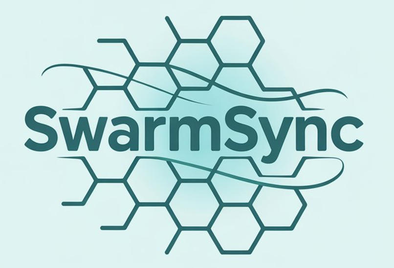

<h1 align="center">🤖 Welcome to TheBinder AI</h1>
<h3 align="center">AI-powered Collective Intelligence Engine — where humans and AI work side by side!</h3>

  

  
  

---

##  Organization Overview: TheBinder AI

**TheBinder AI** is the home of our innovationsin **open source** and **research-driven projects**. Under TheBinder AI, we’re building our flagship product: **Jukto — The Collaborative Data OS (Operating System)**.

---

## 🚀 Product Spotlight: What Is Jukto?

  

Jukto is a next-generation **Collaborative Data Operating System (OS)** designed to unify fragmented workflows into a single, AI-native layer. It enables teams to turn raw data into **collective intelligence**, blending code, natural language, and real-time collaboration. Palantir proved what’s possible when organizations fuse data and decision-making. But Foundry is closed and out of reach for most. Jukto democratizes that power: an accessible, flexible data OS for teams of any size. Built for transparency, trust, and collaboration between humans and AI.

---

## Mission & Vision

**Mission:**  
To empower every organization to turn raw data into collective intelligence by unifying fragmented tools into a single, collaborative operating system.

**Vision:**  
Jukto will become the default data OS for organizations, replacing fragmented tools with a single layer where humans + AI reason together. “Every company will run on data. Jukto is how they’ll run on intelligence.”

---

## 🧠 Featured Open Source Projects

### [SwarmSync-SDK](https://github.com/TheBinder-AI/SwarmSync-SDK)  

🧠 SwarmSync-SDK - Collaborative AI Agent Swarms for Autonomous Task Synchronization

  

Welcome to learn about our open-source **SwarmSync-SDK** project, where we are building **AI-powered agent swarms** that collaborate like human teams. Our vertical multi-agent swarms can autonomously handle complex tasks such as software development, market research, product design, operational workflows—**10x faster** and at a fraction of the cost.

### Key Features
- **Human-Like Collaboration**: AI agents dynamically allocate tasks and make decisions as a team.
- **Vertical Swarms**: Specialized for software development, market research, operations, and more.
- **Tool Integration**: Syncs with GitHub, Linear, web browsers, and search engines for end-to-end workflows.
- **Scalable & Modular**: Build custom swarms to tackle any complex task, faster and smarter.

---
### [SwarmSync Deep Research](https://github.com/TheBinder-AI/SwarmSync-Deep-Research)

📡 Open-source deep research engine — you can now build your own Perplexity, ChatGPT, or Gemini-like tool.

---
### AI-native **FinOps agentic brain - "Axilo"**

- ⚙️ AI-native multi-agentic brain for FinOps that automates end-to-end financial workflows.
- 🏛 21-day delta program at [The Residency](https://www.livetheresidency.com/).

---

### [COGNIX CLI](https://github.com/TheBinder-AI/cognix-cli)

🧬 Open-source multi-agentic CLI to perform autonomous research and analysis.

---

## 🤝 Join Us or Collaborate

We're actively building and growing our open-source and stealth products. Here's how you can get involved:

- 💬 **Join the conversation**: Connect on X or LinkedIn  
- 🧠 **Feedback or collaboration ideas?**: We’d love to hear them!  
  
---

## 📬 Contact Us

Have ideas, feedback, or want to collaborate? Connect with us:  

- 🌐 **Website**: Coming soon  
- 𝕏  **Twitter**: [@TheBinderAI](https://x.com/TheBinderAI)  
- ℹ️ **LinkedIn**: [TheBinder AI](https://www.linkedin.com/company/thebinder/)  
- 📦 **PyPI**: [PyPI Organization](https://pypi.org/org/thebinder_ai/)

---

  <strong>💡Build smarter, faster, and together.</strong>

